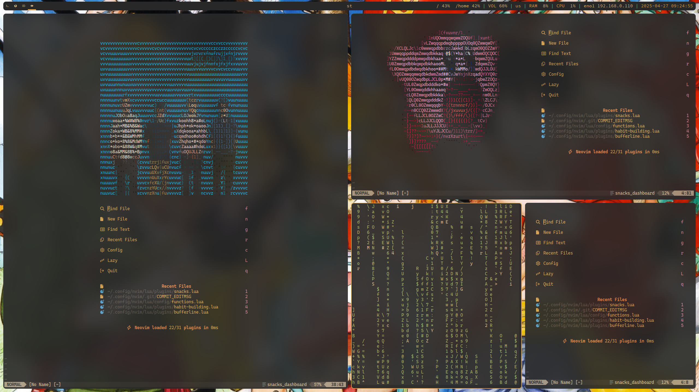
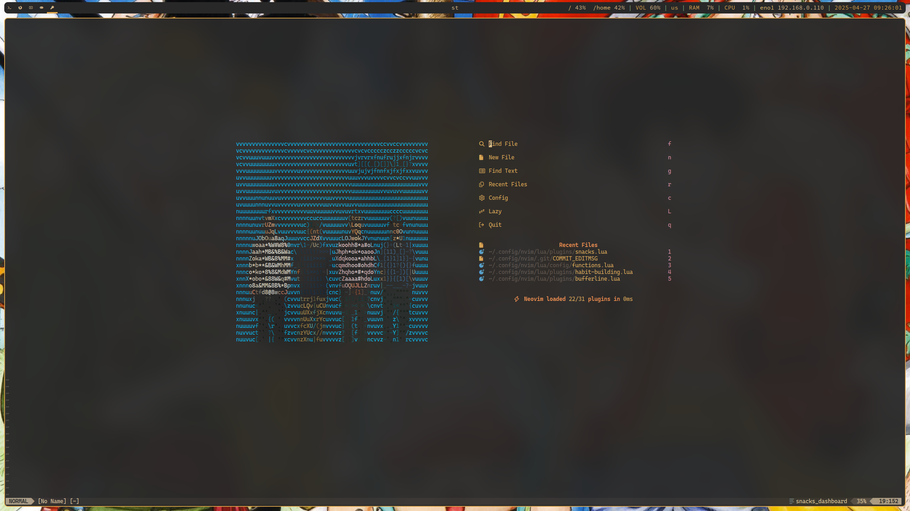

# MY NEOVIM CONFIGURATION

## List of plugins
### UI
- [folke/snacks.nvim](https://github.com/folke/snacks.nvim)
- [akinsho/bufferline](https://github.com/akinsho/bufferline.nvim)
- [nvim-lualine/lualine.nvim](https://github.com/nvim-lualine/lualine.nvim)
- [sainnhe/gruvbox-material](https://github.com/sainnhe/gruvbox-material)
- [folke/noice.nvim](https://github.com/folke/noice.nvim)
    - [MunifTanjim/nui.nvim](https://github.com/MunifTanjim/nui.nvim)
    - [rcarriga/nvim-notify](https://github.com/rcarriga/nvim-notify)
- [nvim-tree/nvim-web-devicons](https://github.com/nvim-tree/nvim-web-devicons)

### TEXT EDITING
- [echasnovski/mini.ai](https://github.com/echasnovski/mini.ai)
- [echasnovski/mini.pairs](https://github.com/echasnovski/mini.pairs)
- [echasnovski/mini.splitjoin](https://github.com/echasnovski/mini.splitjoin)
- [echasnovski/mini.surround](https://github.com/echasnovski/mini.surround)
- [echasnovski/mini.indentscope](https://github.com/echasnovski/mini.indentscope)
- [echasnovski/mini.comment](https://github.com/echasnovski/mini.comment)

### WORKLFLOW
- [stevearc/oil.nvim](https://github.com/stevearc/oil.nvim)
- [nvim-telescope/telescope.nvim](https://github.com/nvim-telescope/telescope.nvim)
    - [nvim-lua/plenary.nvim](https://github.com/nvim-lua/plenary.nvim)
    - [nvim-telescope/telescope-symbols.nvim](https://github.com/nvim-telescope/telescope-symbols.nvim)
- [folke/zen-mode.nvim](https://github.com/folke/zen-mode.nvim)
    - [folke/twilight.nvim](https://github.com/folke/twilight.nvim)

### TREESITTER, LSP, COMPLETION
- [nvim-treesitter/nvim-treesitter](https://github.com/nvim-treesitter/nvim-treesitter)
- [williamboman/mason.nvim](https://github.com/williamboman/mason.nvim)
    - [williamboman/mason-lspconfig.nvim](https://github.com/williamboman/mason-lspconfig.nvim)
    - [neovim/nvim-lspconfig](https://github.com/neovim/nvim-lspconfig)
- [echasnovski/mini.completion](https://github.com/echasnovski/mini.completion)

### GIT INTEGRATION
- [tpope/vim-fugitive](https://github.com/tpope/vim-fugitive)
- [airblade/vim-gitgutter](https://github.com/airblade/vim-gitgutter)

### HABIT BUILDING
- [ThePrimeagen/vim-be-good](https://github.com/ThePrimeagen/vim-be-good)
- [m4xshen/hardtime.nvim](https://github.com/m4xshen/hardtime.nvim)

## OTHER DEPENDENCIES
- [TheZoraiz/ascii-image-converter](https://github.com/TheZoraiz/ascii-image-converter)
    - required for dashboard ASCII art
